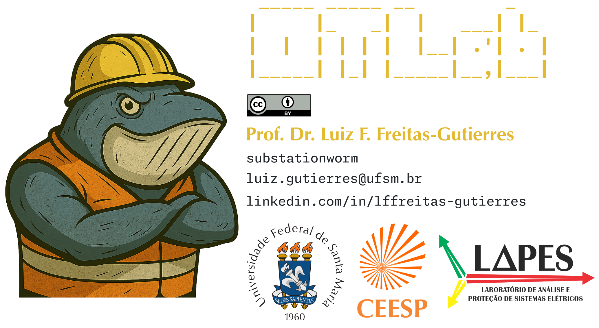
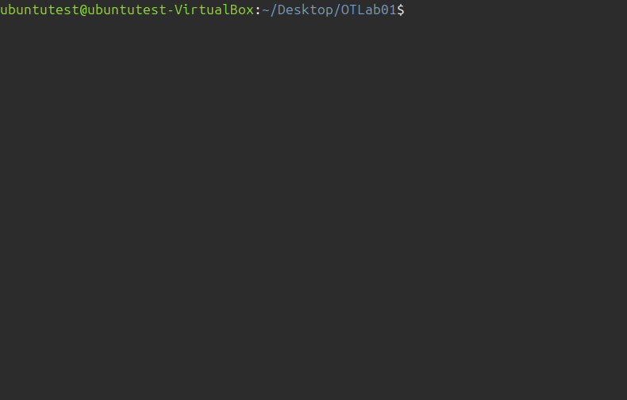

# OTLab



**OTLab** is a suite of scripts developed to emulate operational technologies (OT) and industrial control systems (ICS) using containerized environments powered by [Docker](https://www.docker.com/).

**OTLab** is part of the educational project "[CYBERENG001] Industrial Cybersecurity for Engineers" ([064306](https://portal.ufsm.br/projetos/publico/projetos/view.html?idProjeto=426877)), coordinated by [Prof. Dr. Luiz F. Freitas-Gutierres](https://www.linkedin.com/in/lffreitas-gutierres/) at the Federal University of Santa Maria ([UFSM](https://www.ufsm.br/)). The project aims to advance engineering education offering hands-on, container-based OT-ICS emulation environments that support experiential learning and training in the field of industrial cybersecurity.

The following animation illustrates the basic usage of an **OTLab** script, demonstrating its core functionalities:

<p align="center">
  
  <br>
  <em>Figure 01. OTLab basic usage.</em>
</p>

```
Usage: ./OTLab01.sh -start [kali|ubuntu] | -stop | -clean | -run | -restart

  -start     Start the OTLab01 environment using the specified distro (default: ubuntu)
             Valid options: kali (rolling) or ubuntu (22.04)
  -run       Open a terminal inside the otlab-student container
  -clean     Remove containers, volumes, and network
  -stop      Stop all containers
  -restart   Restart previously stopped containers
```

---

*Summary of case studies*:

- [OTLab01](https://github.com/substationworm/OTLab/tree/main/OTLab01): Basics of OT-ICS Device Discovery.
- [OTLab02](https://github.com/substationworm/OTLab/tree/main/OTLab02): Siemens S7 PLC Emulation.
- [OTLab03](https://github.com/substationworm/OTLab/tree/main/OTLab03): Emulation of a Gas Station Control System.
- [OTLab04](https://github.com/substationworm/OTLab/tree/main/OTLab04): Modbus/TCP Emulation and Register Access.